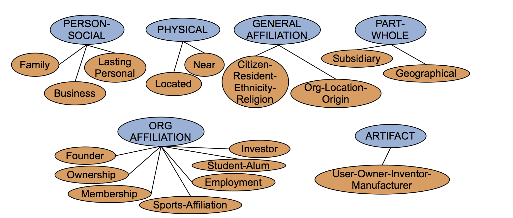

RAT: Relation Extraction
---
Individual Name: ______________  
Team Names: \_\_\_\_\_\_\_\_\_\_\_\_\_\_\_\_\_ &nbsp;&nbsp; \_\_\_\_\_\_\_\_\_\_\_\_\_\_\_\_\_ &nbsp;&nbsp; \_\_\_\_\_\_\_\_\_\_\_\_\_\_\_\_\_ &nbsp;&nbsp; \_\_\_\_\_\_\_\_\_\_\_\_\_\_\_\_\_  

1) Circle one of the following relations that best describes the relationship of the bold words? Write it as a RDF triple.
> "__The Facebook__ was started by __Mark Zuckerberg__". 

2) Which of the following would represent an acceptable use case for using hard-coded patterns to extract relations? (Select all that apply)  
&nbsp;&nbsp;&nbsp;&nbsp; A. Finding the number of bids on items on eBay   
&nbsp;&nbsp;&nbsp;&nbsp; B. Finding who are a particular person's friend through reading his/her biography  
&nbsp;&nbsp;&nbsp;&nbsp; C. Finding all the names and associated numbers in a phone directory  
&nbsp;&nbsp;&nbsp;&nbsp; D. Finding who person follows on Twitter  

3) True or False: The bootstrap method is nondeterministic (it will give different outputs for the same corpus).  Why?

 
 

4) Define Named Entity Recognition (NER) in Plain English.

 
 

5) Define add-one smoothing in Plain English. Why is it useful?