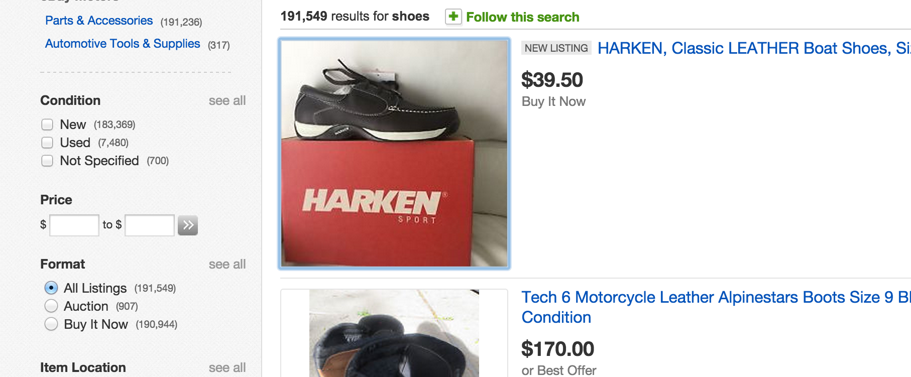

##Part 1: Using the PyMongo Client

The PyMongo Client resembles Python much more than the Mongo shell we have dealt with this morning. In most applications, you will use PyMongo to interact with your Mongo Database as part of your data pipeline. 

<br>

1. Use the follow snippet to start a Pymongo client and create a new collection (table) within a new database.   
  
   ```python
   from pymongo import MongoClient
   client = MongoClient()
   # Initiate Database
   db = client['test_database']
   # Initiate Table
   tab = db['test_table']
   ```
2. Insert an entry into the collection you have initiated. Check if the entry is inserted from the mongo shell.
   Query the inserted entry from Pymongo.

3. Try updating the entry you have inserted and verify that it has been updated.

<br>

##Part 2: Practice CSS Selectors

CSS selectors are an important part of web scraping as they allow you to select content on a web page. Refer to 
this [document](css_selector_cheatsheet.pdf) if you need a reminder of the CSS selectors that are available to you.
The best way to test out CSS selectors is to use the `Inspect Element` tool in the Google Chrome browser. We will
walk through the work flow in the exercise below.

<br>

1. Open up `data/ebay_shoes.html` with Google Chrome. It should be as shown below.

   

   <br>
   
2. Right click on the first shoe image and click `Inspect Element` to bring up a panel, as seen below.

   

   <br>

3. Construct a CSS select that would allow you to select every shoe image on the page.
   The CSS selector should be referring to the `img` tag of a particular class. 
   Click `Console` to switch to the console mode. Select the CSS selector by entering into the console `$('your css selector')`. Hover over one of the selected elements to inspect it.

   <br>

4. Open up IPython in your terminal and import BeautifulSoup4 with the line `from bs4 import BeautifulSoup`.
   Read `data/ebay_shoes.html` in as one string from the file and put it into a `BeautifulSoup()` with the 
   line `soup = BeautifulSoup(html_str, 'html.parser')`. 

   You should be able to use the CSS selector on the soup using `soup.select('your css selector')`. It will 
   then return a list of tags that each contains the source of the image location. Create a list of the paths to the    image locations by looping through the tags and accessing the image path by `tag['src']`.

5. Open the file paths and read the files in as string. Write them to a new directory named `images`. Open the   
   files in the `images` directory to ensure the images are saved properly.

6. This is the basic work flow of web scraping with CSS selectors. Realistically you would not be reading in a local
   html file, but read the html file from a link instead. Go to ebay, search for your a product of your choice and 
   copy the link. Use the `get` function in the [`requests` library](http://docs.python-requests.org/en/latest/)
   to retrieve the html. The `get` function returns a response where `response.content` returns the html as a 
   string.
   
7. Retrieve the product descriptions from your selected page by following the web scraping work flow.  

<br>

##Part 4: Scraping using the meta data

**At this point:**
- **We have successful gathered article metadata from the NYT API**
- **We have stored said data in MongoDB**
- **We have URLs for each article that we can now use for scraping**

<br>

1. Now that we have all the meta data, it it time to get the article content!  We will be doing something 
   I call a data join (some people call it [data blending](http://www.tableausoftware.com/videos/data-integration)... but they charge you money so they can call it that).
    * Iterate over your collection in your database.  For all the articles for which you do not have HTML content 
      (this will be all of them to begin with), use the 'web url' in the meta data to make a web request.
    
  
    * Use Beautiful Soup to parse the returned HTML. Make sure to initialize `soup` with:   
      `soup = BeautifulSoup(response.text, 'html.parser')`
      
    * Add a new field in the meta data records in your Mongo database to store the raw HTML from the web page.
    
    * Find the CSS selectors that would allow you to extract article text in the web pages. You can use the Chrome 
      DevTools to help you find the relevant CSS Selectors. If you are having problems such as
      `$ is not a function`. Use the following script to load in the jQuery library and then try again.
  
      ```js
      var jq = document.createElement('script');
      jq.src = "https://ajax.googleapis.com/ajax/libs/jquery/1/jquery.min.js";
      document.getElementsByTagName('head')[0].appendChild(jq);
      ```
      
    * Use `soup.select(Your CSS Selector)` to extract article text from the web pages.
    
    * Add a new field in the meta data records in your Mongo database to store the text of the articles.
   

You have made it to the end (hopefully succcessfully).  Now that you have your data and have contextualized it with information from the web, you can start performing some interesting analyses on it.

<br>

## Extra

### User Login

Scraping sites is easy when you can have clear access to the content and it is in a semi-structured form.  One issue that arises with scraping sites is the need to login.  

1. Find a site that you might want to get data from that requires a login.

* Use [Mechanize](http://wwwsearch.sourceforge.net/mechanize/) to login to a site to scrape.
* [Mechanize For Beginners](http://www.pythonforbeginners.com/mechanize/browsing-in-python-with-mechanize/)
* [Mechanize Login Tutorial](http://simplapi.wordpress.com/2012/04/20/pythons-mechanize-login-like-a-user/)
* Example code in [advanced_scraping.ipynb](advanced_scraping.ipynb)

### Client side templating

Some sites do what is called [client side templating](http://www.smashingmagazine.com/2012/12/05/client-side-templating/), basically you send only data from the server and write a bunch of Javascript to dynamically write HTML when the page loads.

1. Find a site that templates on the client.
2. Look at the [Chrome Developer Tools](http://thewc.co/articles/view/web-inspector-tutorial) to find which "Resource" the data came in. __Hint Hint, look for a JSON file__

### Automated Scraper

Scraping the web from your laptop is great, but what if you want to automate things and have a long running process (scraping for days...)?  A common solution is to setup a script that continuous scrapes the web from a hosted virtual server on something like Amazon Web Service (AWS).

1. Follow along on the auxiliary AWS sprint here: [https://github.com/zipfian/aws-and-the-cloud](https://github.com/zipfian/aws-and-the-cloud#assignment)
2. Setup an automated scraper on AWS using [cron](http://www.unixgeeks.org/security/newbie/unix/cron-1.html) or a [python scheduler](https://github.com/dbader/schedule)
3. Save the scraped files to [S3](http://aws.amazon.com/s3/) or a database.

### Proxy

Some sites block IPs from know bad actors.  LinkedIn actually does this for any Amazon Web Services (AWS) IP address.  But us being the smart data scientists we are, we will devise a solution!


[Tor](https://www.torproject.org/) is a lovely community built around anonymization on the web.  Tor allows for users to browse the web anonymously by daisy chaining a request across a network of nodes to hide the origin IP of the request.


1. Using Tor and its [Python client](https://stem.torproject.org/tutorials.html), try to setup a scraper that is anonymized.  Bonus points if you host your scraper on AWS and successful can scrape LinkedIn profile pages.